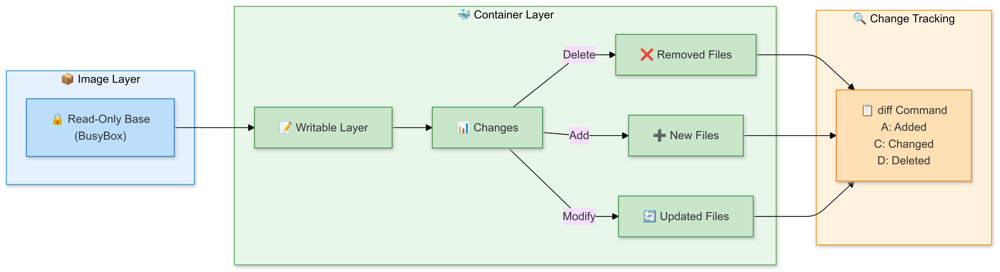

# 🐳 Docker Filesystem Changes Explorer

[](https://github.com/TheToriqul/docker-filesystem-changes)
[](https://github.com/TheToriqul/docker-filesystem-changes/stargazers)


## 📋 Project Overview

This project demonstrates my deep dive into Docker's filesystem architecture, specifically focusing on how Docker manages file changes within containers. Through practical implementation, I've explored Docker's Union File System (UFS) and copy-on-write mechanisms, developing expertise in container filesystem management and debugging.


## 🎯 Key Objectives

- Master Docker's Union File System (UFS) architecture and layering system
- Implement real-world container filesystem operations
- Analyze and track filesystem changes across container layers
- Understand copy-on-write mechanisms in Docker
- Develop container debugging and troubleshooting skills


## 🏗️ Project Architecture

The project architecture implements Docker's filesystem management through three interconnected components: a read-only Image Layer using BusyBox as the base, a dynamic Container Layer that handles all filesystem modifications (add, modify, delete) through a writable layer, and a Change Tracking System that monitors and records all modifications using Docker's diff command. This layered approach enables efficient filesystem operations while maintaining data integrity, with changes being tracked using simple codes (A for additions, C for changes, D for deletions) to provide a clear audit trail of container modifications.

<figure >
  <p align="center">
      
      <p align="center">Project Architecture</p> 
  </p>
</figure>

## 💻 Technical Stack

- Frontend: N/A
- Backend: Docker Engine
- Database: N/A
- DevOps: 
  - Docker
  - Shell Scripting
  - Linux Commands
  - BusyBox


## 🚀 Getting Started

<details>
<summary>🐳 Prerequisites</summary>

- Docker Engine (version 20.10 or higher)
- Linux/Unix-based operating system
- Terminal access with sudo privileges
- Basic understanding of container concepts

</details>

<details>
<summary>⚙️ Installation</summary>

1. Clone the repository:
   ```bash
   git clone https://github.com/TheToriqul/docker-filesystem-changes.git
   ```
2. Navigate to the project directory:
   ```bash
   cd docker-filesystem-changes
   ```

</details>

<details>
<summary>🎮 Usage</summary>

1. Add a new file to a container:
   ```bash
   docker container run --name tweak-a busybox:latest touch /HelloWorld
   ```
2. Check filesystem changes:
   ```bash
   docker container diff tweak-a
   ```
3. Explore more operations:
   ```bash
   docker container run --name tweak-d busybox:latest rm /bin/vi
   ```

For detailed commands and explanations, refer to the [reference-commands.md](reference-commands.md) file.

</details>


## 💡 Key Learnings

### Technical Mastery:

1. Comprehensive understanding of Docker's Union File System
2. Expert knowledge of container layer management
3. Proficiency in filesystem change tracking
4. Advanced container debugging techniques
5. Mastery of copy-on-write mechanisms

### Professional Development:

1. Enhanced problem-solving through container debugging
2. Improved system architecture understanding
3. Strengthened DevOps methodologies
4. Better grasp of containerization best practices
5. Advanced troubleshooting capabilities


### 🔄 Future Enhancements

<details>
<summary>View Planned Improvements</summary>

1. Implement automated testing for filesystem operations
2. Add monitoring capabilities for filesystem changes
3. Create visualization tools for layer management
4. Develop comprehensive cleanup scripts
5. Include volume management scenarios
6. Add support for multi-container filesystem operations
</details>


## 🙌 Contribution

Contributions are welcome! Feel free to [open an issue](https://github.com/TheToriqul/docker-filesystem-changes/issues) or submit a [pull request](https://github.com/TheToriqul/docker-filesystem-changes/pulls) to suggest improvements or add features.


## 📧 Connect with Me

- 📧 Email: toriqul.int@gmail.com
- 📱 Phone: +65 8936 7705, +8801765 939006
- 🌐 LinkedIn: [@TheToriqul](https://www.linkedin.com/in/thetoriqul/)
- 🐙 GitHub: [@TheToriqul](https://github.com/TheToriqul)
- 🌍 Portfolio: [TheToriqul.com](https://thetoriqul.com)

Let's connect and discuss all things containerization!


## 👏 Acknowledgments

- [Poridhi for providing comprehensive labs and inspiring this project](https://devops.poridhi.io/)
- Docker community for excellent documentation
- Open source container ecosystem contributors
- Fellow developers who provided valuable feedback
- Container technology pioneers


---

Thank you for exploring this Docker filesystem project. I hope you find it valuable for understanding container internals and filesystem management. Happy containerizing! 🐋